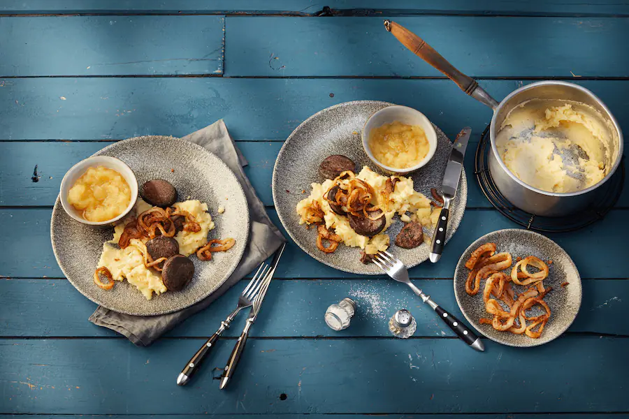

# Rezepte von Jana
***
***

## Himmel un Ääd

Typisch kölsches Gericht. 
Die Zutaten des Gerichts sind für die Namensgebung verantwortlich:
**Äpfel** wachsen im Himmel, die **Kartoffeln** kommen aus der Erde (Ääd oder auch Äd).
Im Originalrezept wird *Blutwurst* verwendet, wie unten auch beschrieben ist. Da ich aber kein Fan von Blutwurst bin, würde ich persönlich das Rezept mit Frikadellen machen.

***
##### Zutaten

- 600g Blutwurst (oder eben mit Frikadellen)
- 1 kg Kartoffeln (mehligkochend)
- 2 Gemüsezwiebeln
- 4 Äpfel
- 150ml Apfelsaft
- 50g Butter
- 100ml Sahne
- 1 EL Zitronensaft
- 50g Zucker
- 1 Prise Zimt
- etwas Salz
- etwas Pfeffer
- 1 Prise Muksat
- 4 EL Mehl
- 5 EL Sonnenblumenöl

***
##### Zubereitung
1. Zwiebeln schälen und in Ringe schneiden. Äpfel schälen, entkernen und würfeln. Apfelsaft mit Zitronensaft und Zucker aufkochen und 5 Minuten köcheln lassen. Die Apfelwürfel und Zimt hinzugeben und weitere 10-15 Minuten zu Kompott köcheln lassen.
2. Die Kartoffeln schälen und grob würfeln. In gesalzenem Wasser ca. 15 Minuten gar kochen. Das Wasser abgießen und die Kartoffeln mit Butter, Sahne und Muskat zu Püree stampfen. Mit Pfeffer und Salz abschmecken.
3. Die Blutwurst in dicke Scheiben schneiden und im Mehl wälzen. 2 EL Öl in einer Pfanne erhitzen und die Blutwurst darin von beiden Seiten anbraten. Die Zwiebeln im restlichen Mehl wenden und in restlichem Öl knusprig braten.
4. Apfelmus mit Kartoffelpüree, Blutwurst und Zwiebeln servieren.

***
##### Nährwerte pro Portion

Nährstoff     | pro Portion | Tagesnateil in %
:-------------|:------------|:----------------
Energie       | 1142 kcal   | 52%
Eiweiß        | 27,5 g      | 50%
Fett          | 78,3 g      | 104%
Kohlenhydrate | 85,2 g      | 28%
Vitamin B12   | 1,2 µg      | 48%
Vitamin C     | 88,9 mg     | 89%
Eisen         | 14 mg       |  100%
Natrium       | 1691,9 mg   | 308%